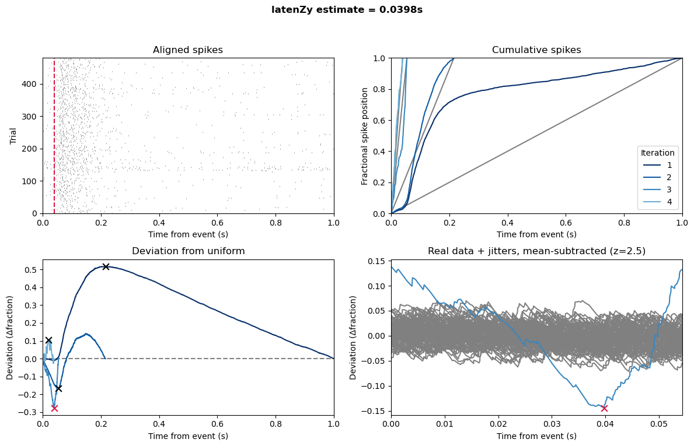
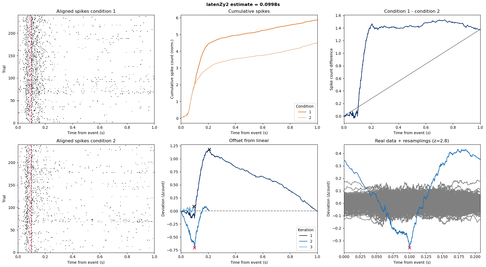

# The *latenZy* repository

Welcome to the *latenZy* repository — a Python and MATLAB toolbox containing two novel, binning-free methods for estimating the onset of neural spiking activity with high temporal precision: `latenZy` and `latenZy2`.

Our preprint describing these methods is now online: ...


## Estimating response latencies with `latenZy`
**`latenZy`** is designed to estimate **when neural responses begin following discrete events** by detecting event-locked changes in spiking rates. 


**Python example:**
```python
from latenzy import latenzy

L, s_latenzy = latenzy(spike_times, event_times, use_max_dur)
print(f"Estimated latency: {L:.2f} ms")
```

**MATLAB example:**
```matlab
[L, sLatenzy] = latenzy(spikeTimes, eventTimes, useMaxDur);
fprintf('Estimated latency: %.2f ms\n', L);
```


*Fig. 1: Detecting neural spiking onset using `latenZy`. Red = estimate.*


## Estimating when spiking starts to diverge with `latenZy2`
**`latenZy2`** identifies the time point at which neural spiking **begins to diverge between experimental conditions**.
  
**Python example:**
```python
from latenzy import latenzy2

L, s_latenzy2 = latenzy2(spike_times1, event_times1, spike_times2, event_times2, use_max_dur)
print(f"Estimated latency: {L:.2f} ms")
```

**MATLAB example:**
```matlab
[L, sLatenzy2] = latenzy2(spikeTimes1, eventTimes1, spikeTimes2, eventTimes2, useMaxDur);
fprintf('Estimated latency: %.2f ms\n', L);
```


*Fig. 2: Detecting the onset of spiking divergence using `latenZy2`. Red = estimate.*

## Dependencies
The Python implementation requires the following packages to work:
- NumPy
- SciPy
- Matplotlib
- Optional: concurrent.futures to reduce computation time

- The MATLAB implementation requires the following Mathworks toolboxes to work:
- Signal Processing Toolbox
- Optional: Parallel Computing Toolbox to reduce computation time

